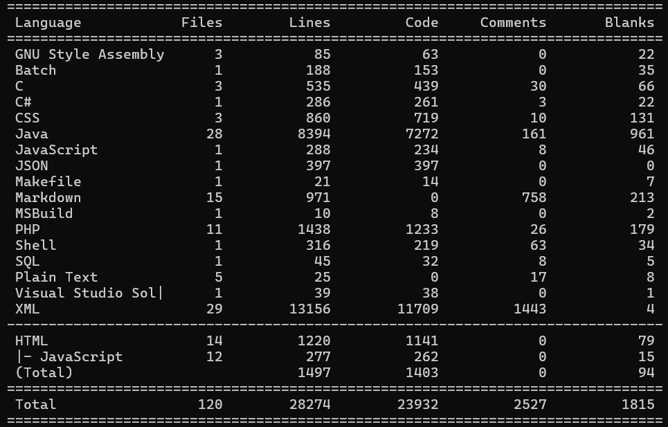

# 👋 Ciao, I'm Nicola  
Welcome to my GitHub space! Here, I share independent projects I develop to explore and deepen my knowledge.

# Table of Contents
- [🛠️ Main Projects](#-main-projects)
- [🔧 Other Projects](#-other-projects)
  - [☕ Java](#-java)
  - [🌐 Web Apps](#-web-apps)
  - [🧩 C# Projects](#-c-projects)
  - [🧠 C Projects](#-c-projects-1)
- [🧮 Code Statistics](#-code-statistics)
- [📫 Contacts](#-contacts)

## 🛠️ Main Projects
🎬 Movie Database (Web App)  
This project allows users to browse and search for movies in a clean, responsive interface.  
👉 [repository](https://github.com/Shalafi01/php-MovieDatabase)
    
🧑‍💼 Seasonal Worker Management (JavaFX)  
This project implements a system for managing and searching seasonal workers.  
👉 [repository](https://github.com/Shalafi01/javafx-TalentView)
    
🎴 Briscola app (Java)  
This Java Swing application lets you play a fully functional game of Briscola, a classic Italian card game.  
👉 [repository](https://github.com/Shalafi01/java-Briscola/tree/main)
    
🛡️ Encrypted Messenger (Java)  
Client-server chat application with AES, DES, and 3DES encryption.  
👉 [repository](https://github.com/andrea97/encrypted-messenger-java)
    
## 🔧 Other projects

### ☕ Java

ContactBook  
This Java Swing application provides a basic address book functionality, allowing users to add, view, search, and remove contacts.  
👉 [repository](https://github.com/Shalafi01/java-ContactBook)
    

quickRename  
Quick Rename is a simple Java Swing application designed to help you efficiently rename multiple files within a selected directory.  
👉 [repository](https://github.com/Shalafi01/java-quickRename)
    

quickFinder  
This Java Swing application helps you quickly find differences between the files in two selected directories.  
👉 [repository](https://github.com/Shalafi01/java-quickFinder)
    

quickTextEdit  
This is a simple Java Swing application designed to help you quickly clean up and format text.  
👉 [repository](https://github.com/Shalafi01/java-quickTextEdit)
    

### 🌐 Web Apps
checklist  
A simple checklist web app built with HTML, CSS, and JavaScript.  
👉 [repository](https://github.com/Shalafi01/js-checklist)
    

motherboard  
An interactive view helpful to understand and get to know a motherboard in all of its parts.  
👉 [repository](https://github.com/Shalafi01/js-motherboard)
    

### 🧩 C# Projects
ContactBook
A simple console-based Contacts application written in C#.  
👉 [repository](https://github.com/Shalafi01/csharp-ContactBook)  
 

### 🧠 C Projects
SystemV-Tris
A terminal-based implementation of the classic Tic-Tac-Toe game built in C using System V IPC mechanisms.  
👉 [repository](https://github.com/Shalafi01/c-SystemV-Tris)  
 

car-dashboard  
Simple car dashboard menu system implemented in C and Assembly.  
👉 [repository](https://github.com/Shalafi01/asm-car-dashboard/)  
  

## 🧮 Code Statistics

## 📫 Contacts

- Email: tomasoni.nicola@gmail.com
- LinkedIn: [linkedin.com/in/nicola-tomasoni-609bb0198/](https://www.linkedin.com/in/nicola-tomasoni-609bb0198/)
